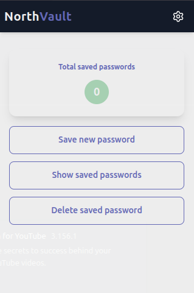

# 🌐 m223rx – NorthVault Password Manager (Chrome Extension)



---

## 🚀 Features  

- **Secure Password Vault**  
  Encrypts and stores passwords locally in the browser using strong encryption with a master password.  

- **Master Password Authentication**  
  Only the user with the master password can access saved credentials.  

- **Save, Update & Delete Credentials**  
  Easily manage service credentials with unique IDs for each entry.  

- **Copy to Clipboard**  
  Quickly copy passwords to the clipboard with a single click.  

- **Encrypted Local Storage**  
  Ensures passwords are safely stored in the browser without sending data online.  

- **Responsive & Intuitive UI**  
  Clean, modern interface designed for smooth interaction in a Chrome popup.  

- **User Config Management**  
  Stores user preferences like theme, vault path, and version in local storage.  

---

## 🛠 Tech Stack

- **Languages:**  
  - [JavaScript](https://developer.mozilla.org/en-US/docs/Web/JavaScript) – app logic and encryption  
  - [React](https://reactjs.org/) – UI components and state management  
  - [CSS/Tailwind](https://tailwindcss.com/) – styling  

- **Libraries:**  
  - [lucide-react](https://lucide.dev/) – icons  
  - [react-hot-toast](https://react-hot-toast.com/) – notifications  
  - [crypto.subtle](https://developer.mozilla.org/en-US/docs/Web/API/SubtleCrypto) – password hashing & encryption  

- **Deployment:**  
  - Chrome Extension (Manifest v3)  
  - Runs entirely in-browser, no server required  

---

## ⚡ Usage

1. **Clone the repository:**

   ```
   git clone https://github.com/m223rx/northvault-extension.git
   cd northvault-extension
   ```

2. **Install dependencies**  
  ```
  npm install
  ```

3. **Build the React app for Chrome Extension**  
  ```
  npm run build
  ```

4. **Load the extension in Chrome**  
  - Open chrome://extensions/

  - Enable Developer mode

  - Click Load unpacked and select the build folder

5. **Use NorthVault**  
  - Click the extension icon in Chrome to open the popup
  - Sign up with a username and master password
  - Save, view, or delete passwords directly in the extension

---

## 🎨 Customization

- Change themes or colors in src/App.css or Tailwind config.
- Adjust encryption or vault storage methods in src/helpers/cryptoHelpers.js.
- Modify UI components in src/pages to fit your design preference.

---

## 💡 Future Enhancements

- Add password generator with strength indicators.
- Enable syncing across devices using secure cloud storage.
- Multi-user support with separate encrypted vaults.
- Dark/Light mode toggle for the extension UI.
- Export and backup vault securely.

---

## 👨‍💻 Developer

m223rx – 2025  

© 2025 m223rx. All rights reserved.
